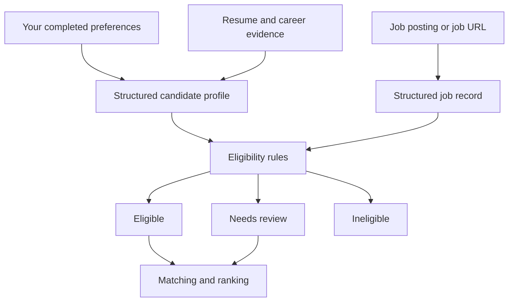
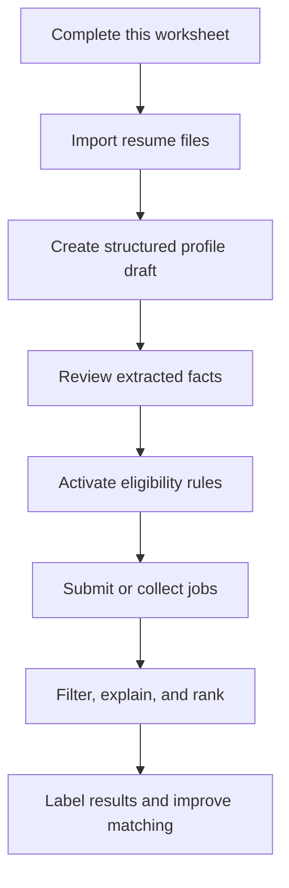

# Job-tool Data Intake Worksheet

## Purpose

Use this document to define what the Job-tool should know about you before it evaluates jobs. Fill it out in plain language. You do not need to write code or YAML.

This document separates three kinds of information:

- **Eligibility rules:** objective rules that can reject a job or send it to manual review.
- **Ranking preferences:** factors that make an eligible job more or less attractive.
- **Candidate evidence:** facts from your resume and work history that can support a match.

The system should never infer a hard rejection from a vague preference. If information is missing from a posting, it should normally return `needs_review`, not automatically reject the job.

## How to Complete This Worksheet

1. Replace `[Your answer]` with your answer.
2. Delete options that do not apply where instructed.
3. Use `None` if a category does not matter to you.
4. Use `Unknown` if you have not decided yet.
5. Be especially precise in sections marked **Eligibility**.
6. Do not add resume claims you could not defend in an interview.

---

# Part 1 — Search Rules and Preferences

## 1. Search Geography

### Home location

- City and state: `[Your answer]`
- ZIP code, if useful for distance calculations: `[Your answer]`

### On-site and hybrid work — Eligibility

- Maximum one-way distance: `[Number] miles`
- Is the distance a hard maximum? `Yes / No`
- Maximum one-way commute time, if more important than miles: `[Number] minutes / Not applicable`
- Acceptable cities or regions: `[Your answer]`
- Locations to always reject: `[Your answer]`
- Relocation willingness: `No / Maybe / Yes`
- If relocation is possible, acceptable destinations and conditions: `[Your answer]`

### Remote work — Eligibility

- Fully remote jobs accepted: `Yes / No`
- Remote jobs restricted to your state accepted: `Yes / No`
- Remote jobs restricted to the United States accepted: `Yes / No`
- Hybrid jobs accepted: `Yes / No`
- Maximum required office days per week: `[0–5]`
- Travel to headquarters accepted: `Yes / No / Depends`
- Maximum travel frequency: `[Your answer]`

### Work authorization — Eligibility

- Country or countries where you are authorized to work: `[Your answer]`
- Need current or future sponsorship: `Yes / No`
- Clearance held, if any: `[Your answer / None]`
- Clearance requirements that should trigger rejection: `[Your answer / None]`

## 2. Compensation

Distinguish base salary from total compensation. A stated salary range that overlaps your floor can be reviewed rather than automatically rejected.

### Salary rules — Eligibility

- Absolute minimum acceptable base salary: `$[Amount] per year`
- Equivalent minimum hourly rate for contract/hourly work: `$[Amount] per hour / Not applicable`
- Reject a job when the posted maximum is below the absolute floor: `Yes / No`
- If compensation is missing, classify as: `Eligible / Needs review / Ineligible`
- Currency requirements: `[Your answer]`

### Compensation preferences — Ranking

- Target base-salary range: `$[Minimum]–$[Maximum]`
- Desired total-compensation range: `$[Minimum]–$[Maximum] / Not important`
- Bonus importance: `Low / Medium / High`
- Equity importance: `Low / Medium / High`
- Minimum benefits or retirement requirements: `[Your answer / None]`
- Other compensation preferences: `[Your answer / None]`

## 3. Employment Arrangement

For each arrangement, enter `Accept`, `Prefer`, `Avoid`, or `Reject`.

| Arrangement | Decision | Conditions or notes |
|---|---|---|
| Full-time employee | `[Answer]` | `[Notes]` |
| Part-time employee | `[Answer]` | `[Notes]` |
| Fixed-term employee | `[Answer]` | `[Notes]` |
| W-2 contract | `[Answer]` | `[Notes]` |
| 1099 contract | `[Answer]` | `[Notes]` |
| Contract-to-hire | `[Answer]` | `[Notes]` |
| Freelance or project work | `[Answer]` | `[Notes]` |
| Temporary role | `[Answer]` | `[Notes]` |
| Commission-only role | `[Answer]` | `[Notes]` |

Additional eligibility rules:

- Minimum contract length: `[Your answer / None]`
- Maximum or minimum weekly hours: `[Your answer / None]`
- Schedule restrictions: `[Your answer / None]`
- Overtime, weekend, or on-call restrictions: `[Your answer / None]`
- Maximum travel percentage: `[Your answer / None]`

## 4. Target Roles

### Strong target titles — Ranking

List titles that are usually promising. Add as many as needed.

1. `[Title]`
2. `[Title]`
3. `[Title]`
4. `[Title]`
5. `[Title]`

### Adjacent or exploratory titles — Ranking

List titles that may be good when the responsibilities fit, even if the wording is unfamiliar.

1. `[Title]`
2. `[Title]`
3. `[Title]`
4. `[Title]`
5. `[Title]`

### Excluded titles — Eligibility

Only list a title here if it should be rejected regardless of an otherwise attractive description.

1. `[Title or title pattern]`
2. `[Title or title pattern]`
3. `[Title or title pattern]`

### Role-family preferences — Ranking

Rate each from `0` (not interested) to `5` (very interested).

| Role family | Interest 0–5 | Notes |
|---|---:|---|
| Marketing leadership | `[0–5]` | `[Notes]` |
| Product marketing | `[0–5]` | `[Notes]` |
| Strategic communications | `[0–5]` | `[Notes]` |
| Content strategy | `[0–5]` | `[Notes]` |
| Creative or production leadership | `[0–5]` | `[Notes]` |
| Video or broadcast production | `[0–5]` | `[Notes]` |
| Internal or executive communications | `[0–5]` | `[Notes]` |
| Technical enablement or evangelism | `[0–5]` | `[Notes]` |
| Project or program management | `[0–5]` | `[Notes]` |
| Other: `[Role family]` | `[0–5]` | `[Notes]` |

## 5. Seniority and Responsibility

### Seniority — Eligibility and ranking

For each level, enter `Prefer`, `Accept`, `Avoid`, or `Reject`.

| Level | Decision | Conditions or notes |
|---|---|---|
| Entry level | `[Answer]` | `[Notes]` |
| Coordinator | `[Answer]` | `[Notes]` |
| Specialist | `[Answer]` | `[Notes]` |
| Senior specialist / senior IC | `[Answer]` | `[Notes]` |
| Manager | `[Answer]` | `[Notes]` |
| Senior manager | `[Answer]` | `[Notes]` |
| Director | `[Answer]` | `[Notes]` |
| Senior director | `[Answer]` | `[Notes]` |
| Vice president or executive | `[Answer]` | `[Notes]` |

- Minimum acceptable responsibility level: `[Your answer]`
- Maximum realistic responsibility level right now: `[Your answer]`
- People management desired: `Required / Preferred / Neutral / Avoid`
- Minimum or maximum team size: `[Your answer / None]`
- Individual-contributor roles accepted: `Yes / No / Depends`
- Budget ownership desired: `Required / Preferred / Neutral / Avoid`
- Strategy ownership desired: `Required / Preferred / Neutral / Avoid`
- Hands-on production work desired: `Required / Preferred / Neutral / Avoid`

## 6. Industries and Organizations

### Industry preferences — Ranking

| Industry | Interest 0–5 | Relevant experience or notes |
|---|---:|---|
| `[Industry]` | `[0–5]` | `[Notes]` |
| `[Industry]` | `[0–5]` | `[Notes]` |
| `[Industry]` | `[0–5]` | `[Notes]` |
| `[Industry]` | `[0–5]` | `[Notes]` |
| `[Industry]` | `[0–5]` | `[Notes]` |

### Industry exclusions — Eligibility

- Industries to always reject: `[Your answer / None]`
- Industries to avoid but not automatically reject: `[Your answer / None]`

### Employer preferences — Ranking

- Preferred company size: `[Startup / Small / Medium / Large / Any]`
- Preferred ownership type: `[Public / Private / Nonprofit / Government / Any]`
- Preferred organizational traits: `[Your answer]`
- Organizational traits to penalize: `[Your answer]`
- Employer or brand exclusions: `[Your answer / None]`
- Mission or ethics requirements: `[Your answer / None]`

## 7. Work Content

### Desired responsibilities — Ranking

List the work you want to do. Add an importance from `1` to `5`.

| Responsibility | Importance 1–5 | Notes |
|---|---:|---|
| `[Responsibility]` | `[1–5]` | `[Notes]` |
| `[Responsibility]` | `[1–5]` | `[Notes]` |
| `[Responsibility]` | `[1–5]` | `[Notes]` |
| `[Responsibility]` | `[1–5]` | `[Notes]` |
| `[Responsibility]` | `[1–5]` | `[Notes]` |

### Unwanted responsibilities

Mark each as `Penalty` or `Hard reject`.

| Responsibility or work pattern | Decision | Explanation |
|---|---|---|
| `[Responsibility]` | `[Penalty / Hard reject]` | `[Explanation]` |
| `[Responsibility]` | `[Penalty / Hard reject]` | `[Explanation]` |
| `[Responsibility]` | `[Penalty / Hard reject]` | `[Explanation]` |

### Work environment preferences — Ranking

- Desired amount of autonomy: `[Your answer]`
- Preferred balance of strategy and execution: `[Your answer]`
- Preferred pace and workload: `[Your answer]`
- Collaboration preferences: `[Your answer]`
- Presentation or public-facing work preference: `[Your answer]`
- Writing preference: `[Your answer]`
- Technical-depth preference: `[Your answer]`
- Creative-work preference: `[Your answer]`
- Other environment preferences: `[Your answer / None]`

## 8. Qualifications and Missing Requirements

These rules tell the system when a job requirement should cause rejection or review.

### Education

- Highest completed degree: `[Your answer]`
- Fields of study: `[Your answer]`
- Treat a higher degree listed as **preferred** as: `Ignore / Small penalty / Needs review`
- Treat a higher degree listed as **required** as: `Ineligible / Needs review`
- Education equivalency rules, such as experience in lieu of degree: `[Your answer]`

### Certifications, licenses, and clearances

List credentials you currently hold:

| Credential | Issuer | Status or expiration |
|---|---|---|
| `[Credential]` | `[Issuer]` | `[Status]` |

Rules for missing credentials:

- Missing preferred certification: `Ignore / Penalty / Needs review`
- Missing required certification that can be earned after hiring: `Needs review / Ineligible`
- Missing legally required license or clearance: `Needs review / Ineligible`

### Experience thresholds

- If a posting asks for slightly more years than your resume shows: `Keep eligible / Needs review / Ineligible`
- Number of years over your documented experience that is still acceptable: `[Number]`
- Treat domain experience as transferable when responsibilities align: `Yes / No / Depends`
- Treat exact industry experience marked **required** as: `Needs review / Ineligible`

### Tools and technologies

- Missing a preferred tool when you know an equivalent: `Ignore / Small penalty / Needs review`
- Missing a required tool when you know an equivalent: `Eligible with flag / Needs review / Ineligible`
- Missing a required tool with no equivalent experience: `Needs review / Ineligible`
- Tools or technologies that must always be present: `[Your answer / None]`
- Tools or technologies that should trigger rejection: `[Your answer / None]`

## 9. Hard Rejections

State the exact conditions that should make a job automatically ineligible. Avoid broad or subjective phrases.

| Hard-rejection rule | Exact condition or phrases | Exceptions |
|---|---|---|
| `[Rule]` | `[Condition]` | `[Exceptions / None]` |
| `[Rule]` | `[Condition]` | `[Exceptions / None]` |
| `[Rule]` | `[Condition]` | `[Exceptions / None]` |
| `[Rule]` | `[Condition]` | `[Exceptions / None]` |
| `[Rule]` | `[Condition]` | `[Exceptions / None]` |

Examples of precise rules:

- Reject commission-only compensation; do not reject salaried roles with a performance bonus.
- Reject jobs that explicitly require relocation outside the approved area.
- Reject jobs whose posted maximum base salary is below the absolute floor.
- Reject roles whose primary responsibility is cold-call sales or quota-based prospecting.

## 10. Uncertainty Rules

Choose how the system should behave when a job posting omits important information.

| Missing or ambiguous field | Eligible | Needs review | Ineligible |
|---|:---:|:---:|:---:|
| Salary | `[ ]` | `[ ]` | `[ ]` |
| Remote or hybrid arrangement | `[ ]` | `[ ]` | `[ ]` |
| Exact work location | `[ ]` | `[ ]` | `[ ]` |
| Employment type | `[ ]` | `[ ]` | `[ ]` |
| Travel requirement | `[ ]` | `[ ]` | `[ ]` |
| Required credential wording | `[ ]` | `[ ]` | `[ ]` |
| Seniority | `[ ]` | `[ ]` | `[ ]` |

- General bias when evidence is incomplete: `Keep / Review / Reject`
- Any exceptions: `[Your answer / None]`

---

# Part 2 — Candidate Evidence From Resumes and Career Data

You may fill this section manually or supply existing resumes and let the importer extract a draft for your approval. Preferences from Part 1 should never be inferred from a resume.

## 11. Identity and Contact Data

- Full professional name: `[Your answer]`
- Professional location: `[Your answer]`
- Email: `[Your answer]`
- Phone: `[Your answer]`
- Website: `[Your answer]`
- LinkedIn: `[Your answer]`
- Portfolio links: `[Your answer]`
- Contact fields that should not be stored by the Job-tool: `[Your answer / None]`

## 12. Professional Summary

- Current professional identity in one or two sentences: `[Your answer]`
- Years of total relevant experience: `[Your answer]`
- Primary professional domains: `[Your answer]`
- Strongest differentiators: `[Your answer]`
- Career-transition or positioning notes: `[Your answer / None]`

## 13. Work History

Repeat this block for every relevant position.

### Position `[Number]`

- Employer: `[Your answer]`
- Employer industry: `[Your answer]`
- Official title: `[Your answer]`
- Functional title, if the official title understates the work: `[Your answer / None]`
- Location: `[Your answer]`
- Start date: `[YYYY-MM]`
- End date: `[YYYY-MM / Present]`
- Employment type: `[Your answer]`
- Scope of responsibility: `[Your answer]`
- People managed: `[Number / None]`
- Budget or operational ownership: `[Your answer / None]`
- Core responsibilities: `[Your answer]`
- Tools and platforms used: `[Your answer]`
- Industries or audiences served: `[Your answer]`

Achievements should use one fact per row. Do not combine unrelated claims.

| Achievement | Measurable result | Skills demonstrated | Source or confidence |
|---|---|---|---|
| `[What you did]` | `[Result]` | `[Skills]` | `[Resume / records / memory; high, medium, or low confidence]` |
| `[What you did]` | `[Result]` | `[Skills]` | `[Source and confidence]` |

## 14. Skills

Group skills by evidence level instead of creating one undifferentiated keyword list.

### Demonstrated skills

Skills supported by work history or accomplishments:

| Skill | Proficiency | Years used | Most recent use | Evidence or role |
|---|---|---:|---|---|
| `[Skill]` | `[Basic / Working / Advanced / Expert]` | `[Years]` | `[Year]` | `[Evidence]` |

### Transferable skills

Skills you can credibly apply in an adjacent role:

| Skill | Source experience | Target application |
|---|---|---|
| `[Skill]` | `[Evidence]` | `[Where it transfers]` |

### Familiarity only

Skills or tools you understand but should not be presented as hands-on expertise:

- `[Skill or tool]`

### Skills not possessed

Common requirements the matcher must not claim you have:

- `[Skill, credential, or experience]`

## 15. Education and Credentials

| Type | Institution or issuer | Program or credential | Field | Completion date | Notes |
|---|---|---|---|---|---|
| `[Degree / certification / training]` | `[Name]` | `[Name]` | `[Field]` | `[Date]` | `[Notes]` |

## 16. Portfolio and Work Samples

| Sample | URL | Work type | Skills demonstrated | Your role | Publicly shareable? |
|---|---|---|---|---|---|
| `[Name]` | `[URL]` | `[Type]` | `[Skills]` | `[Role]` | `[Yes / No]` |

## 17. Evidence and Truthfulness Rules

- Facts that must always be stated exactly as written: `[Your answer / None]`
- Claims that need confirmation before use: `[Your answer / None]`
- Confidential information that must never be surfaced: `[Your answer / None]`
- Metrics that are approximate rather than exact: `[Your answer / None]`
- Employers, clients, or projects requiring anonymization: `[Your answer / None]`
- May the system infer a broader skill from documented evidence? `Yes / No / Only with review`
- May the system rewrite wording without changing meaning? `Yes / No`
- May the system invent or estimate missing metrics? `No` is recommended.

---

# Part 3 — Job Data Intake

The Job-tool can receive jobs from automated collection, a URL, pasted text, or a structured file. Every job should preserve its original source.

## 18. Minimum Job Fields

The following fields should be captured whenever available:

| Field | Required for storage? | If missing |
|---|---|---|
| Source and source job ID | Yes | Generate a stable fallback ID |
| Canonical URL | Preferred | Store source without link |
| Title | Yes | Reject import as incomplete |
| Company | Yes | Mark unknown only for confidential postings |
| Full description | Yes for matching | Store but do not rank until supplied |
| Location | Preferred | Apply the uncertainty rule |
| Remote/hybrid/on-site status | Preferred | Apply the uncertainty rule |
| Salary range and currency | Preferred | Apply the uncertainty rule |
| Employment type | Preferred | Apply the uncertainty rule |
| Posted or updated date | Preferred | Retain first-seen timestamp |
| Required qualifications | Extracted | Flag uncertain language |
| Preferred qualifications | Extracted | Flag uncertain language |
| Travel and schedule | Extracted | Apply the uncertainty rule |

## 19. Manual Job Submission Format

For a job you want analyzed, provide either:

### Option A — URL

- Job URL: `[Paste URL]`
- Any login or access limitation: `[Your answer / None]`
- Notes or specific concerns: `[Your answer / None]`

### Option B — Pasted posting

- Job title: `[Your answer]`
- Company: `[Your answer]`
- Location: `[Your answer]`
- Source URL: `[Your answer / None]`
- Full posting text: `[Paste the complete posting]`
- Notes or specific concerns: `[Your answer / None]`

## 20. Job Analysis Output

For each job, the structured analysis should return:

- Eligibility: `eligible`, `needs_review`, or `ineligible`
- Eligibility reasons and the exact posting evidence
- Hard-rejection rule triggered, if any
- Overall match level
- Required qualifications met
- Required qualifications missing or uncertain
- Preferred qualifications met
- Transferable candidate evidence
- Seniority alignment
- Role and responsibility alignment
- Industry alignment
- Compensation and location alignment
- Risks or likely interview objections
- Evidence-based explanation
- Source URL and collection date

The analyzer must distinguish between:

- `met`: supported by documented candidate evidence
- `transferable`: credible adjacent evidence exists
- `missing`: candidate evidence indicates the requirement is not met
- `unknown`: the available candidate data cannot answer it
- `not_applicable`: the requirement does not affect this job

---

# Part 4 — Feedback for Improving Recommendations

## 21. Review Labels

Choose the labels you want to use when reviewing recommendations. Suggested defaults:

- `strong_match`: Would seriously consider applying.
- `consider`: Worth reviewing or applying with caveats.
- `weak_match`: Technically possible but unattractive or unlikely.
- `reject`: Not worth pursuing.
- `hard_reject`: Violates a rule and similar jobs should be filtered.

Preferred label names or changes: `[Your answer / Use defaults]`

## 22. Rejection and Interest Reasons

Select or add common reasons so feedback can be measured consistently.

Interest reasons:

- `[ ]` Responsibilities fit
- `[ ]` Strong evidence match
- `[ ]` Good title or career progression
- `[ ]` Preferred industry
- `[ ]` Compensation
- `[ ]` Remote or location fit
- `[ ]` Organization or mission
- `[ ]` Learning opportunity
- `[ ]` Other: `[Your answer]`

Rejection reasons:

- `[ ]` Compensation
- `[ ]` Location or relocation
- `[ ]` Employment arrangement
- `[ ]` Seniority mismatch
- `[ ]` Sales or quota emphasis
- `[ ]` Responsibilities unattractive
- `[ ]` Missing required qualification
- `[ ]` Industry or employer concern
- `[ ]` Schedule, travel, or workload
- `[ ]` Poor organizational signals
- `[ ]` Other: `[Your answer]`

## 23. Outcome Tracking

Mark which events you want the Job-tool to track:

- `[ ]` Saved
- `[ ]` Applied
- `[ ]` Recruiter response
- `[ ]` Interviewed
- `[ ]` Withdrew
- `[ ]` Rejected by employer
- `[ ]` Offer received
- `[ ]` Offer accepted
- `[ ]` Other: `[Your answer]`

---

# Part 5 — Processing and Approval Rules

## 24. Import Approval

When resumes or career documents are imported:

- Automatically accept extracted facts: `Yes / No`
- Require review before facts become active evidence: `Yes / No`
- Keep the original source text with each extracted fact: `Yes / No`
- Treat conflicting facts as: `Use newest / Needs review / Other: [Answer]`
- Treat missing dates as: `Estimate / Needs review / Leave blank`

Recommended approach: extract a structured draft, preserve the source, and require approval for new or conflicting claims.

## 25. Decision Policy

- Can ranking preferences ever override a hard rejection? `No` is recommended.
- Can an administrator manually override an eligibility decision? `Yes / No`
- If yes, should the override be saved with a reason? `Yes / No`
- Should `needs_review` jobs remain in the recommendation queue? `Yes / No`
- Should ineligible jobs remain searchable for audit? `Yes / No`
- Should profile changes cause stored jobs to be reevaluated? `Yes / No`

## 26. Data Maintenance

- How often should preferences be reviewed? `[Monthly / Quarterly / Other]`
- How often should resume evidence be reviewed? `[Your answer]`
- Keep previous profile versions: `Yes / No`
- Allow export of all profile, job, and feedback data: `Yes / No`
- Retention period for expired job postings: `[Your answer]`

---

# Completion Checklist

The profile is ready for implementation when these minimum items are complete:

- `[ ]` Home location and remote/hybrid rules
- `[ ]` Absolute salary floor and missing-salary behavior
- `[ ]` Accepted employment arrangements
- `[ ]` Target, adjacent, and excluded roles
- `[ ]` Accepted seniority levels
- `[ ]` Hard-rejection rules
- `[ ]` Uncertainty behavior
- `[ ]` Work history and accomplishments, supplied manually or through resumes
- `[ ]` Demonstrated skills and credentials
- `[ ]` Truthfulness and confidentiality rules
- `[ ]` Feedback labels

## What Happens After You Complete It

The completed worksheet can be converted into a validated machine-readable profile. Resume data becomes candidate evidence; job postings become structured job records. The original documents remain the source of truth, and uncertain information stays explicitly marked rather than being invented.
