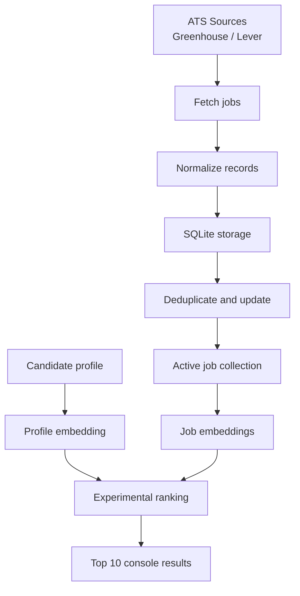
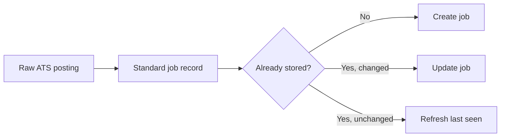
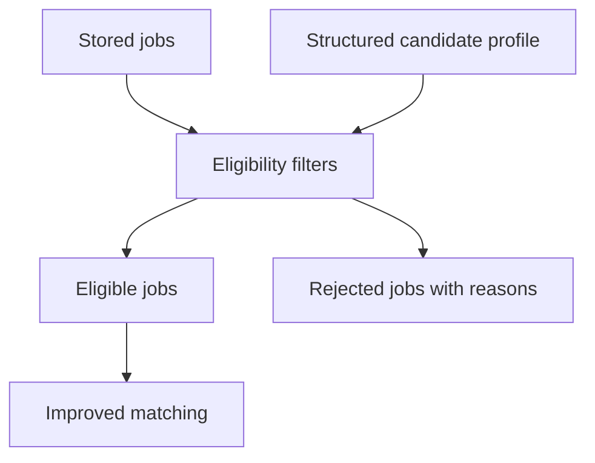
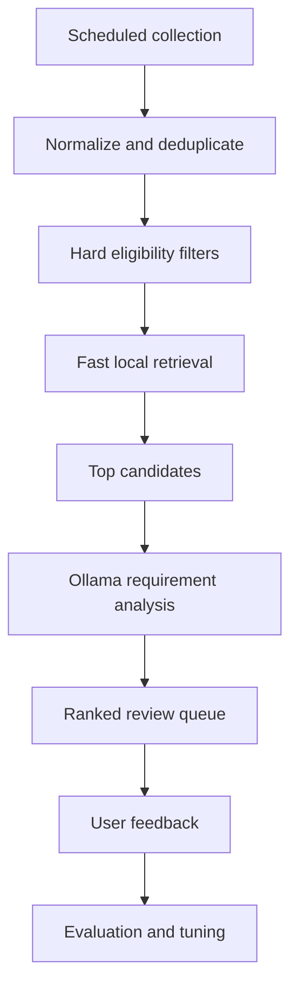

# Job-tool Function Map and Components

**Repository:** `HammerheadFistpunch/Job-tool`  
**Working branch:** `GPT_Redesign`  
**Reference state:** Collection foundation complete; structured profile and eligibility filters planned next.

## System overview



## Two main workflows

### 1. Collection workflow

Command:

```powershell
python -m backend.collect_jobs
```

Function:

1. Reads enabled employers from `config/job_sources.json`.
2. Downloads jobs from Greenhouse or Lever.
3. Converts different source formats into one standard job format.
4. Stores jobs in SQLite.
5. Detects new, changed, and unchanged postings.
6. Records collection statistics and errors.

This is the reliable, completed portion of the application.

### 2. Recommendation workflow

Command:

```powershell
python -m backend.run_recommendations
```

Function:

1. Loads the Markdown candidate profile.
2. Collects and stores current jobs.
3. Creates profile and job embeddings.
4. Extracts a small set of recognized skills.
5. Calculates an experimental match score.
6. Prints the ten highest-scoring jobs.

This portion works technically, but the matching is not yet trustworthy enough for actual job-search decisions.

## Current components

| Component | Location | Function | Status |
|---|---|---|---|
| Source configuration | `config/job_sources.json` | Lists employers and ATS types | Working |
| Job aggregator | `backend/jobs/job_aggregator.py` | Runs all enabled job sources | Working |
| Greenhouse fetcher | `backend/jobs/fetchers/greenhouse_fetcher.py` | Downloads complete Greenhouse postings | Working |
| Lever fetcher | `backend/jobs/fetchers/lever_fetcher.py` | Downloads complete Lever postings | Working |
| Ingestion pipeline | `backend/jobs/job_ingestion.py` | Gives every job the same fields | Working |
| Job store | `backend/storage/job_store.py` | Saves, updates, and deduplicates jobs | Working |
| Database manager | `backend/storage/database.py` | Creates and upgrades the SQLite database | Working |
| Collection command | `backend/collect_jobs.py` | Runs collection without loading AI | Working |
| Candidate profile | `data/input/Profiles/pr_profile.md` | Current source of candidate information | Working, but unstructured |
| Profile loader | `backend/profile/loader.py` | Reads the Markdown profile | Working |
| Candidate schema | `backend/profile/schema.py` | Early structured-profile definition | Scaffold only |
| Job normalizer | `backend/jobs/job_normalizer.py` | Prepares job text for embeddings | Working |
| Embedding service | `backend/ai/embedding_service.py` | Creates semantic vectors using MiniLM | Experimental |
| Job embedding service | `backend/jobs/job_embedding_service.py` | Embeds title, description, and metadata | Experimental |
| Skill extractor | `backend/ai/skill_extractor.py` | Finds recognized keywords | Too limited |
| Ranking engine | `backend/ai/ranking_engine.py` | Combines semantic and skill scores | Experimental |
| Recommendation command | `backend/run_recommendations.py` | Produces console recommendations | Experimental |
| FastAPI application | `main.py` | Currently provides only an online-status endpoint | Scaffold only |
| Ollama analysis | Not built | Detailed requirement/evidence comparison | Planned |
| Review interface | Not built | Review, label, save, or reject jobs | Planned |
| Scheduler setup | Not built | Automatically installs scheduled collection | Collection command is scheduler-ready |

## Database components

The SQLite database currently contains two main tables:

| Table | Purpose |
|---|---|
| `jobs` | Stores complete job postings, URLs, source IDs, timestamps, status, and source data |
| `collection_runs` | Records when collection ran, how many jobs were found, and any source failures |

Jobs are uniquely identified by:

```text
ATS source + source job ID
```

That prevents the same Greenhouse or Lever posting from being inserted repeatedly.

## What happens to one job



The standardized job record includes:

```text
source
external_id
title
company
location
description
canonical_url
posted_at
updated_at
raw source data
```

## Next components to build

The next chunk sits between storage and ranking:



That chunk should add:

- Structured work history, skills, accomplishments, target roles, and preferences.
- Salary, location, remote-work, seniority, and hard-rejection rules.
- A result for every job: `eligible`, `ineligible`, or `needs_review`.
- Specific reasons such as “below salary floor” or “location uncertain.”
- Tests proving hard requirements cannot be overridden by semantic similarity.

## Plain-language status

The tool can now reliably **find and remember jobs**. The next step teaches it which jobs should be considered at all. After that, the matching system can be improved to determine which eligible jobs are genuinely strong matches.

## Planned end-state workflow



