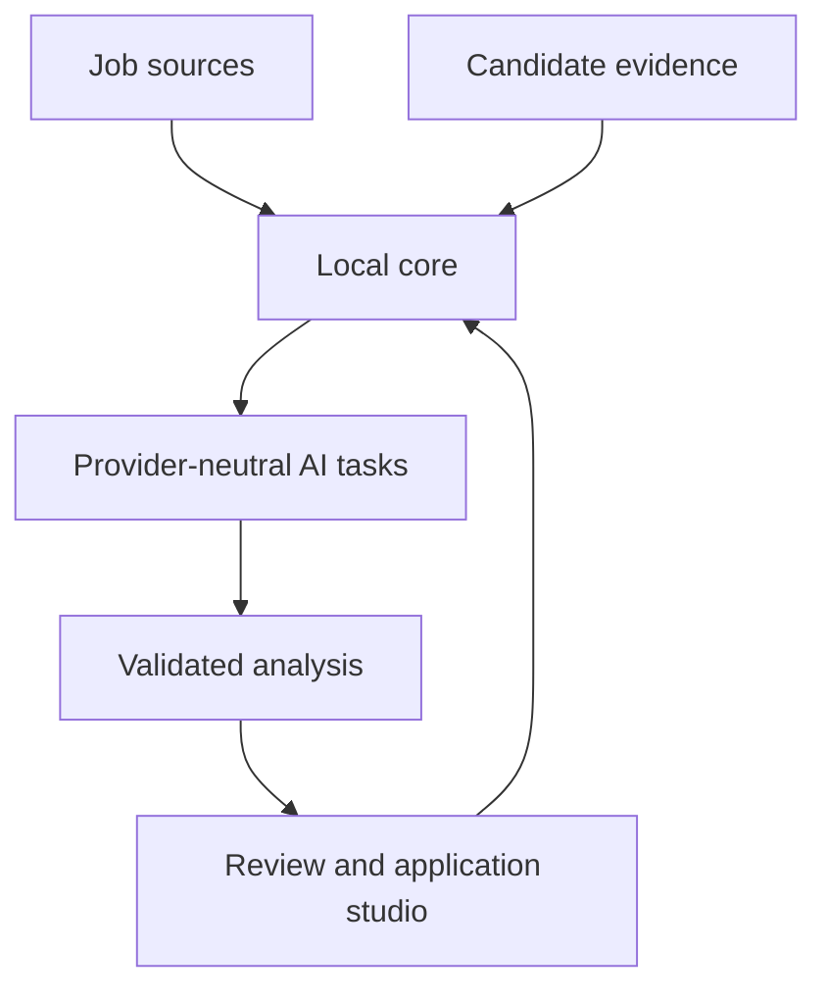
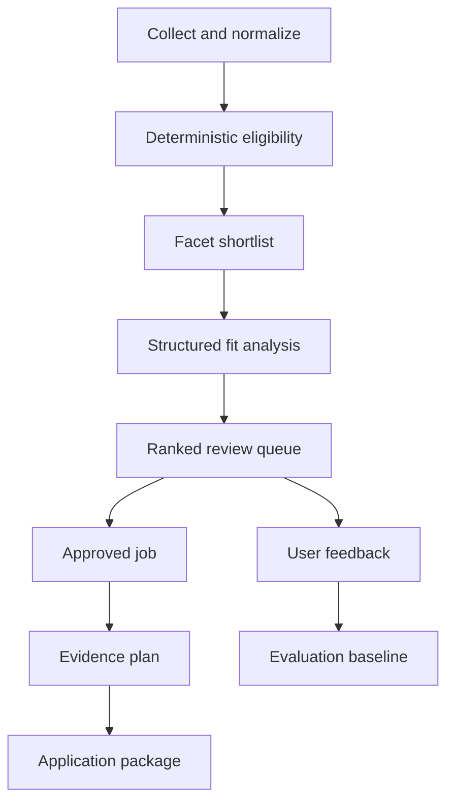
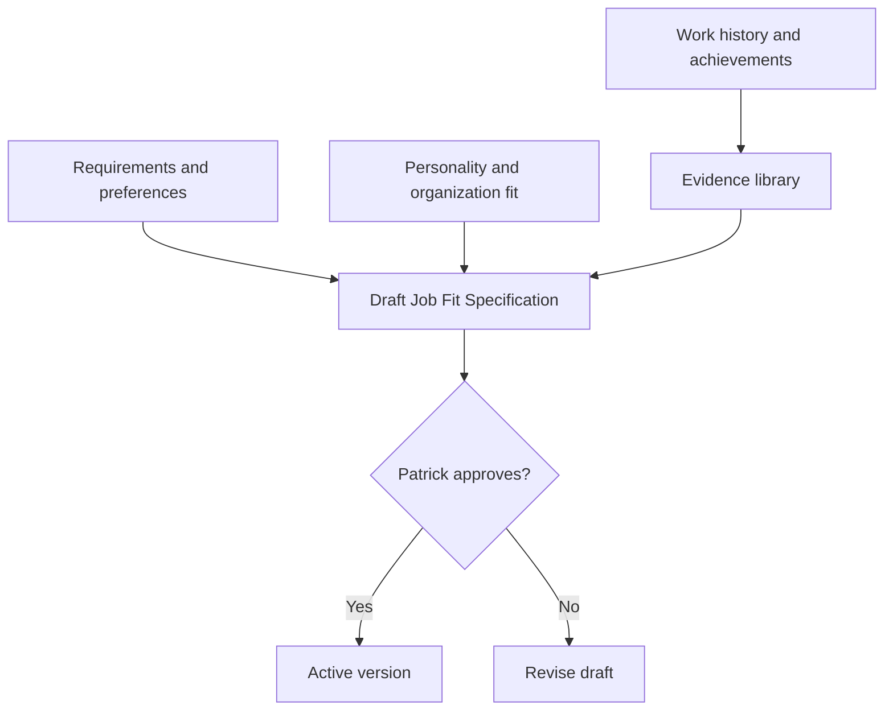

# JobIntel Function Map and Architecture

**Repository:** `HammerheadFistpunch/Job-tool`

**Integration branch:** `GPT_Redesign`

**Reference state:** Discovery, persistence, deterministic eligibility, and the
review queue work. Candidate intelligence, model analysis, application packages,
and installed automation are the next product layers.

## Target system boundary

JobIntel owns data and workflow state. Agents and models call stable operations;
they do not become the system of record.



The **local core** includes collection, normalization, SQLite, deterministic
eligibility, approved fit-spec state, review state, scheduling, and exports. It
must work when the AI task layer is disabled or unavailable.

## End-to-end workflow



## Candidate information flow



Only an approved Job Fit Specification may affect eligibility or ranking. Model
generation is one way to propose a draft; import, manual editing, and another
agent must use the same schema and approval path.

## Current and planned components

| Area | Component/location | Responsibility | Status |
|---|---|---|---|
| Sources | `config/job_sources.json` | Direct boards, broad queries, prefilter | Working |
| Collection | `backend/jobs/` | Fetch, normalize, attribute, deduplicate | Working |
| Persistence | `backend/storage/` | SQLite schema, migrations, job lifecycle | Working |
| Eligibility | `backend/eligibility/` | Explainable hard rules | Working |
| Candidate profile | `data/input/Profiles/patrick_profile.json` | Authoritative structured facts/rules | Working; evidence IDs needed |
| Narrative profile | `data/input/Profiles/pr_profile.md` | Human narrative/legacy embedding input | Non-authoritative |
| Review | `backend/review/`, `main.py` | Queue, labels, states, feedback, metrics | Working |
| Discovery report | `backend/discovery_report.py` | Employer diversity and query health | Working |
| Benchmark importer | `backend/benchmark/`, `backend/import_benchmark.py` | Preserve scheduled-scout candidates, rationale, and provenance | Working |
| Benchmark report | `backend/benchmark_report.py` | Confirmed-positive review and independent-discovery recall | Working; awaiting actual runs |
| Legacy embeddings | `backend/ai/` | MiniLM similarity and keyword scoring | Experimental; not trusted |
| Fit specification | planned `backend/fit_spec/` | Draft, validate, diff, approve, activate | Sprint 1 |
| Evidence library | profile/storage changes | Stable claim IDs and provenance | Sprint 1 |
| Model gateway | planned `backend/ai/providers/` | Disabled/test/Ollama/optional adapters | Sprint 2 |
| Job extraction | planned analysis service | Structured posting requirements/cues | Sprint 3 |
| Facet retrieval | planned retrieval service | AI-independent shortlist | Sprint 3 |
| Fit analysis | planned analysis service | Requirement/evidence comparison | Sprint 4 |
| Application studio | planned application service/UI | Evidence plan and document packages | Sprint 5 |
| Pipeline runner | planned command/service | Idempotent unattended workflow | Sprint 6 |
| Windows scheduler | planned setup commands | Install/status/remove scheduled task | Sprint 6 |
| Agent interface | documented CLI/JSON | Provider- and agent-independent operations | Sprint 8 |

## Storage model

### Existing logical records

| Record | Purpose |
|---|---|
| `jobs` | Normalized job identity, content, links, status, and timestamps |
| `job_discoveries` | Source/query provenance and independent lifecycle |
| `collection_runs` and source results | Run health, counts, failures, and rate-limit metadata |
| `job_eligibility_evaluations` | Profile-versioned hard-rule results and evidence |
| `job_reviews` | Workflow state, label, reasons, notes, and feedback |
| `benchmark_candidates` | Scheduled task/run provenance, selection rationale, fit signals, and concerns |

### Planned logical records

| Record | Purpose |
|---|---|
| `candidate_evidence` | Stable evidence IDs, claim text, type, dates, source, provenance |
| `fit_specifications` | Draft/approved/active versions and source versions |
| `job_extractions` | Job-content-versioned structured requirements and cues |
| `model_runs` | Task/provider/model/prompt/schema/input/output/error metadata |
| `job_fit_analyses` | Requirement-to-evidence findings, gaps, risks, recommendation |
| `application_packages` | Job/spec/evidence versions, approval state, revisions, manifest |
| `pipeline_runs` | Step state, retries, durations, logs, and final status |

Exact tables may be normalized differently during implementation, but these
logical records and version links are required.

## Provider contract

All model tasks use the same envelope:

```text
task name and schema version
input payload and input version/hash
provider and model configuration
prompt/template version
validated structured result or explicit failure
latency, retry count, and timestamp
```

Initial task types:

1. `propose_fit_spec`
2. `extract_job_requirements`
3. `analyze_job_fit`
4. `draft_application_package`

Ollama is the first live adapter. A deterministic adapter supplies repeatable
tests, and a disabled adapter guarantees graceful degradation. Hosted adapters
remain optional.

## Decision order

1. Source prefilter limits obvious market noise.
2. Deterministic eligibility returns `eligible`, `needs_review`, or `ineligible`.
3. Hard-ineligible jobs stop; no later score can restore them.
4. Facet retrieval selects a bounded set of reviewable jobs.
5. Structured analysis maps requirements to stored evidence IDs.
6. Ranking and explanations enter the review queue.
7. Application drafting occurs only after Patrick selects a job.

## Failure behavior

| Failure | Required behavior |
|---|---|
| Job source unavailable | Record failure; never expire that source's jobs |
| AI disabled/unavailable | Continue collection, eligibility, review, and export |
| Invalid model JSON | Reject result; retry within bounds or mark for review |
| Unknown evidence ID | Reject the claim/result |
| Changed job posting | Preserve review; invalidate only content-derived analysis |
| New fit-spec version | Preserve old results; reevaluate with explicit version linkage |
| Interrupted pipeline | Resume safely without duplicating durable records |

## Current next step

Import actual scheduled-task runs and have Patrick confirm or reject the
benchmark candidates. Then implement the discovery-parity report while Sprint 1
adds evidence IDs and the Job Fit Specification. See `DEVELOPMENT_SPRINTS.md`
for tickets, dependencies, and acceptance criteria.
